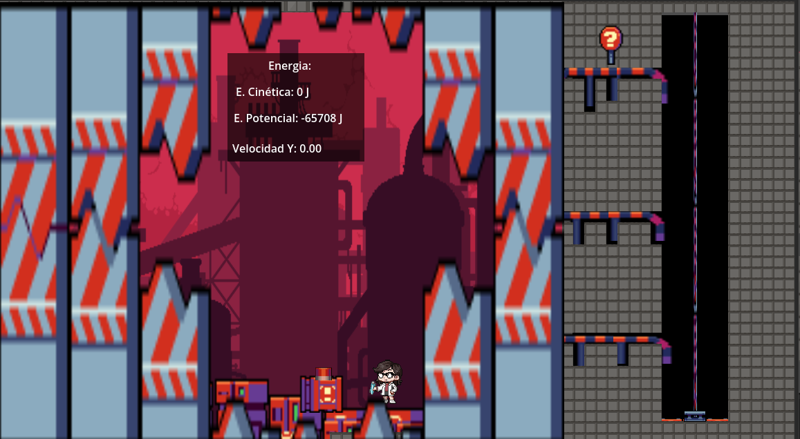

# Fisica Modelo Final

Juego 2D de plataformas y física en el que el objetivo es subir por el escenario, alcanzar la carga y responder preguntas de física para poder recogerla.

## Descripción

En este juego, el jugador debe avanzar por un entorno de estilo industrial, resolver desafíos de física y llegar hasta la carga para completar cada objetivo. La propuesta mezcla exploración, precisión en el movimiento y conocimiento conceptual.

Además, el juego muestra en pantalla información de movimiento y energía para ayudar a entender lo que está pasando durante la partida:

- Energía cinética
- Energía potencial
- Velocidad

## Mecánica principal

1. El jugador se desplaza por el nivel hasta la zona de carga.
2. Para poder recoger la carga, debe responder correctamente preguntas de física.
3. Una vez superada la validación, la carga puede ser tomada y el progreso continúa.
4. Durante la partida se visualizan variables físicas para acompañar la experiencia.

## Características

- Escenario 2D con estética industrial.
- Sistema de preguntas de física para desbloquear la carga.
- Tracking en tiempo real de energía cinética, energía potencial y velocidad.
- Diseño pensado para aprender mientras se juega.

## Controles

Los controles pueden variar según la implementación del nivel, pero en general el juego se maneja con:

- Movimiento lateral del personaje
- Salto
- Interacción con elementos del escenario
- Respuesta a preguntas de física

## Requisitos

- Godot 4.x

## Cómo ejecutar

1. Abrir el proyecto en Godot.
2. Ejecutar la escena principal definida en `project.godot`.
3. Jugar desde la escena `scenes/game-first-level.tscn`.

## Estructura del proyecto

- `scenes/`: escenas y lógica del juego.
- `assets/`: sprites, tiles, fondos y objetos.
- `title_sets/`: recursos relacionados con el nivel.
- `project.godot`: configuración principal del proyecto.

## Vista previa

La interfaz muestra el personaje, el entorno industrial y un panel con las variables físicas activas mientras el jugador progresa por el nivel.

## Notas

Si quieres, puedo adaptar este README para que quede más formal, más corto, o con una sección de instalación y créditos.